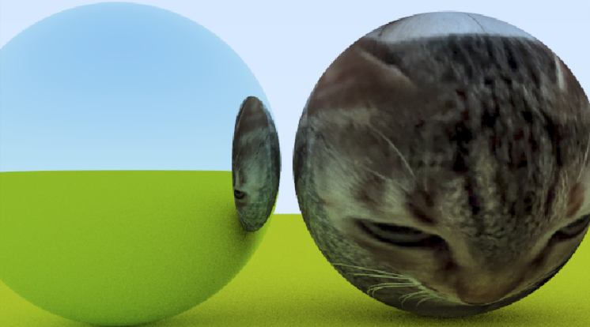
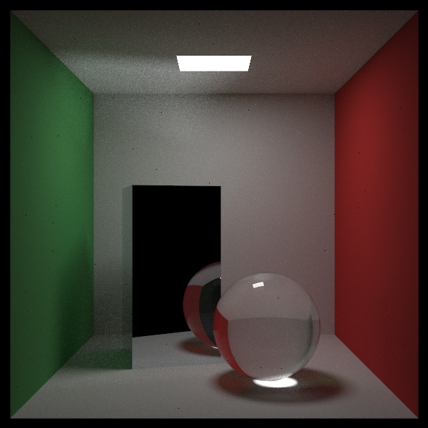
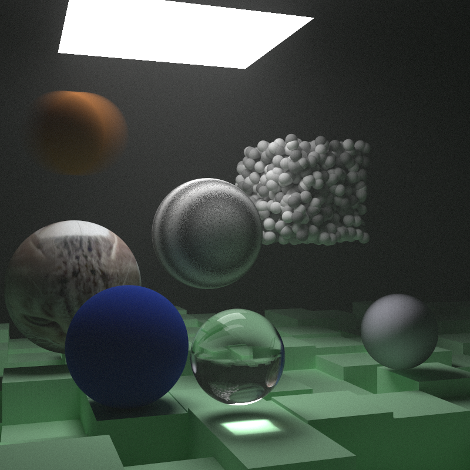

### raytracing the next week but with cuda
renders a bit faster than the original raytracing books code

|junior|cornell|combined|
|:-------------------------:|:-------------------------:|:-------------------------:|
||  ||

### todo

- [ ] Radiance Caching
- [ ] ReSTIR
  
#### resources and things to convert from cpp to cuda
- https://raytracing.github.io/books/RayTracingInOneWeekend.html
- https://developer.nvidia.com/blog/thinking-parallel-part-ii-tree-traversal-gpu/

#### optimization
- maybe remove virtual dispatch and use flat structs for mem locality and no vtable traversal
- faster bvh construction with structs too : https://developer.nvidia.com/blog/thinking-parallel-part-iii-tree-construction-gpu/
- shadow rays instead of mixed pdf