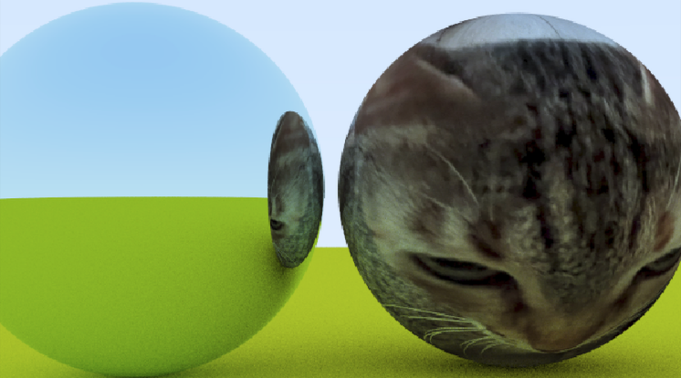
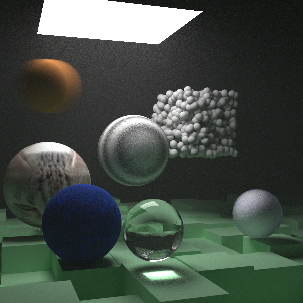
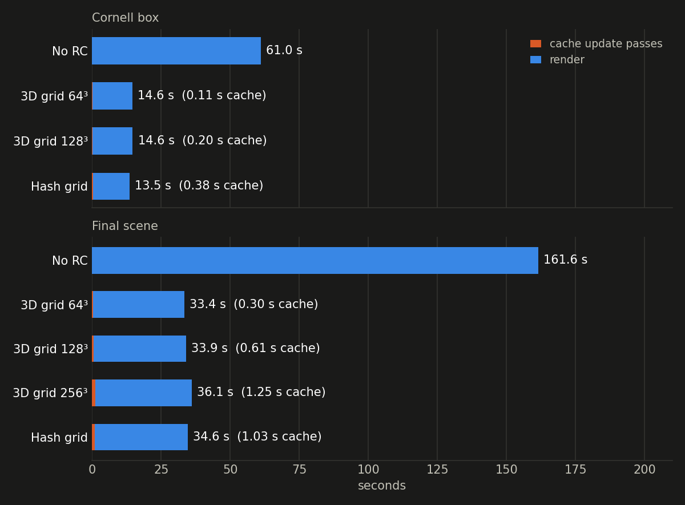
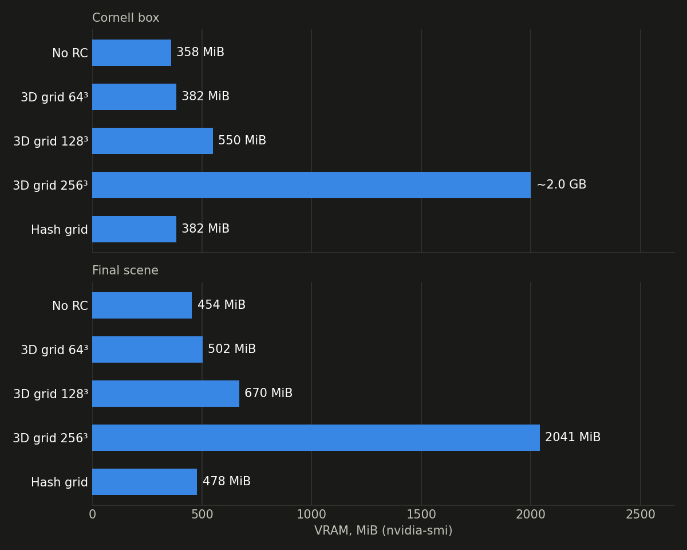
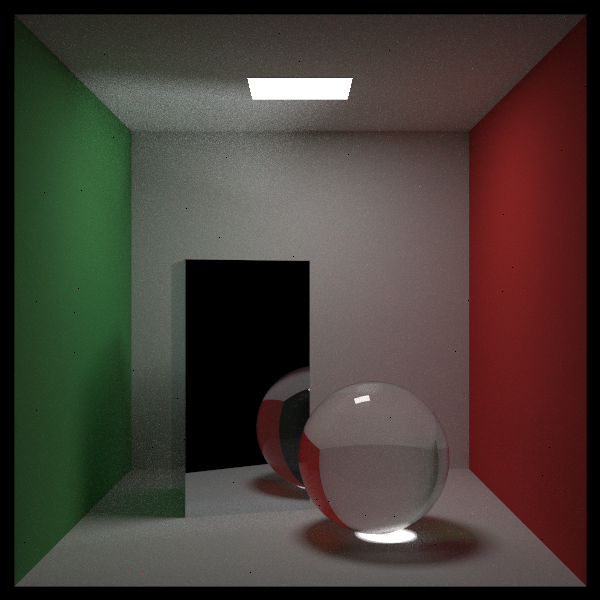
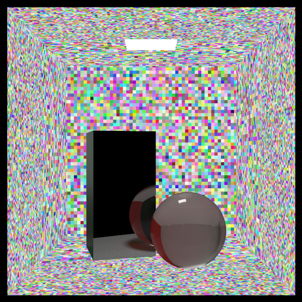
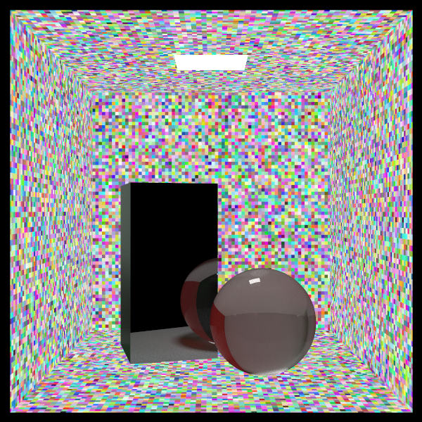

### Path tracer

A software raytracer in written in CUDA, w/ MIS via mixed PDFs, BVH and a hash grid based radiance cache. Renders a faster than the original raytracing: in a weekend book's cpu code that mine is based on. 

|junior|cornell box|scene with everything| 
|:-:|:-:|:-:|
||||

### radiance caching
a few low-spp update passes store the light leaving each small patch of surface in a hash table, keyed by position, normal and a distance-based LOD level. during the render, a path that reaches a diffuse surface after its first diffuse bounce reads the cached value and stops, instead of bouncing up to `max_depth`. Only enabled for diffuse materials, view-dependent materials cause cache cell artifacts.

### speed and memory
same image about 4.5x faster with radiance caching

the hash table uses a fixed 24 MiB for any scene size, while a dense 3d grid grows with resolution³ (~2.0 GB at 256³):

### 3d grid vs hash grid

|no rc|3d grid 64³ (24 MiB)|3d grid 256³ (1.5 GiB)|hash grid + LOD (24 MiB)|
|:-:|:-:|:-:|:-:|
|||||

### LOD

each colour is one cache cell. cells double in size with distance from the camera, so the back of the box gets bigger cells with LOD and everything stays one size with LOD disabled.

|LOD|no LOD|
|:-:|:-:|
|||

### todo

- [x] radiance caching
- [ ] ReSTIR

#### resources and things to convert from cpp (original) to cuda
- https://raytracing.github.io/books/RayTracingInOneWeekend.html
- https://developer.nvidia.com/blog/thinking-parallel-part-ii-tree-traversal-gpu/
- https://github.com/NVIDIA-RTX/SHARC/blob/main/docs/Integration.md

#### optimization
- maybe remove virtual dispatch and use flat structs for mem locality and no vtable traversal
- faster bvh construction with structs too : https://developer.nvidia.com/blog/thinking-parallel-part-iii-tree-construction-gpu/
- shadow rays instead of mixed pdf
